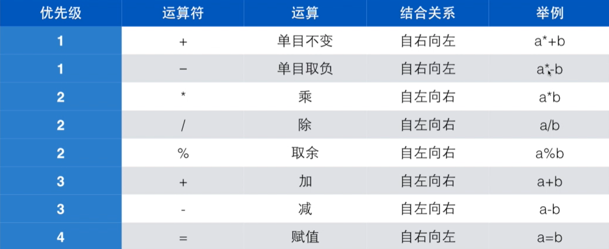

# 02-计算

## 变量

变量的名字是一种`标识符`，基本规则为：标识符只能由字母、数字、下划线组成，数字不可出现在第一个位置上，C语言保留字不可用作标识符。

注意，标识符区分大小写

```c
int asd = 0;
int aSd = 1;
printf("%d %d", asd, aSd); // 0 1
```

### 变量赋值与初始化

在定义变量时，我们应当为其指定一个初始值。

如果未指定初始值，那么程序在变量值时，会将变量所在地址存储的值作为变量的值，这个值是不可预测的。

```c
int a;
int b = 0;
printf("%d %d", a, b); // > 16 0
```

同时定义多个变量，必须逐个赋值而不能统一赋值，未赋初始值的变量则使用地址原有内容作为其值。

```c
int a, b = 100, c = 99;
printf("%d %d %d", a, b, c); // > 1016 100 99
```

C99标准允许你**在任何位置**定义变量，只要你在这个变量第一次使用前定义即可。

而在传统的标准中，**必须在代码开头定义变量**，一旦开始执行了其他操作就不能再定义变量。

## scanf

`scanf`与`printf`一样是一个函数，我们称`printf`为格式化输出，称`scanf`为格式化输入，其中的`f`即为`format`。

`scanf`第一个参数为一个字符串，我们称之为格式字符串。

```c
scanf("%d", &price);
```

要让程序正确处理输入，那么就必须**遵循格式字符串**的格式输入。

```c
int a = 0;
int b = 0;

scanf("%d %d", &a, &b);
scanf("%d,%d", &a, &b);
scanf("%d %d ", &a, &b);
printf("%d %d", a, b);
```

## 常量与变量

我们修改之前的`change.c`程序，将原来的100改为由常量`AMOUNT`定义。

```c
const int AMOUNT = 100;

int price = 0;
printf("请输入金额:");
scanf("%d", &price);

int change = AMOUNT - price;
printf("找您%d元", change);
```

常量不可被修改，如果有修改常量的操作，编译器会报错。

## 数据类型

### 浮点数

五尺七换算为米：

`(5 + 7 / 12) * 0.3048 = 1.7018`

```c
printf("请分别输入身高的英尺和英寸");

int foot;
int inch;

scanf("%d %d", &foot, &inch);

printf("身高是:%f米", ((foot + inch/12) * 0.3048)); // > 身高是:1.524000米
```

当我们对两个整数做运算时，他们的结果只能是整数，直接丢掉小数点导致失去精度。

例如，在C中，10和10.0是两个不同的数。

这时需要用到浮点数，对原来的代码进行改进，用`float`定义`foot`与`inch`：

```c
printf("请分别输入身高的英尺和英寸");

double foot;
double inch;

scanf("%lf %lf", &foot, &inch);

printf("身高是:%f米", ((foot + inch/12) * 0.3048)); // > 身高是:1.701800米
```

* float：单精度浮点数
* double：双精度浮点数

浮点数在scanf中格式输出对应`%f`，printf中对应`%f`。

同时，我们也可以将`inch/12`改为`inch/12.0`，也可以达到一样的效果。

### 表达式

表达式由`运算符`和`算子`组成，运算符即为`+-*/%=`，算子可以是变量、常数。

`a = b + 5`中，`a` `b` `5`是算子，`=` `+`是运算符。

%是取余计算，可以取到两数做除法后的余数部分。

```c
// 计算时间差
int h1, m1;
int h2, m2;

printf("请输入时间差:\n");
scanf("%d %d", &h1, &m1);
scanf("%d %d", &h2, &m2);

int t1 = h1*60 + m1;
int t2 = h2*60 + m2;
int t = t1 - t2;

printf("%dh %dmin", t/60, t%60);
```

用`t%60`取到分钟部分，也就是除法的余数部分。

#### 运算符优先级



`a*-b`即为：`a*(-b)`

赋值也是运算，也有结果，自右向左结合，即先做`b=5`，再把`b=5`的结果赋给`a`：

`a=b=5` ==> `a=(b=5)`

尽量避免嵌套赋值！

#### 交换变量

要交换a和b的值：

```c
int a = 5;
int b = 6;
a = b; // a=6 b=6
b = a; // a=6 b=6
```

显然结果不符合我们的预期，起不到交换的作用，我们选择引入中间变量。

```c
int a = 5;
int b = 6;
int t = 0;
t = a; // a=5 b=6 t=5
a = b; // a=6 b=6 t=5
b = t; // a=6 b=5 t=5
```

#### 复合赋值

```c
total *= sum + 12;
  // total = total * (sum + 12);
sum += 12;
  // sum = sum + 12;
```

```c
count++;
count += 1;
count = count + 1;
```

注意区分`a++`与`++a`，本质上`++`是一种副作用，在完成其他操作后，附带着将a的值+1。

a++的结果是+1前的a值，而++a的结果是+1后的a的值。

```c
int a = 0;
int i = 5;
// a = i++; // > 5
a = ++i; // > 6
printf("%d", a);
```